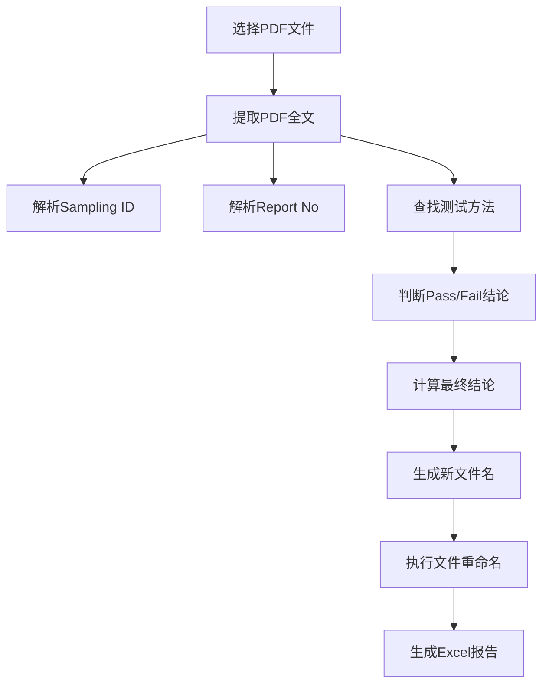

# PDF重命名业务功能使用教程

## 一、功能概述

PDF重命名工具是专门为**Temu产品测试报告**设计的批量重命名工具，能够智能提取PDF文件中的关键信息并按照标准命名约定进行重命名。

### ✨ 核心功能
- **智能信息提取**：自动提取PDF中的Sampling ID、Report No、测试结果
- **智能字段映射**：三层匹配机制，确保字段名准确匹配（直接→大小写不敏感→包含匹配）
- **批量处理**：支持多文件同时处理，提高工作效率
- **测试模式**：提供预览功能，验证提取逻辑正确性
- **Excel报告**：自动生成详细的处理结果报告
- **增强调试**：详细的字段匹配过程日志，便于问题诊断
- **容错处理**：支持加密PDF、格式变化等异常情况

### 🎯 适用场景
- **实验室报告**：化学成分测试、重金属检测等
- **质量检验**：材料性能测试、安全检测等
- **合规认证**：产品合规性测试报告
- **批量归档**：大量测试报告的标准化命名

### 📋 处理流程


---

## 二、准备工作

### 第一步：环境要求

#### 1.1 系统要求
- **操作系统**：Windows 7/8/10/11（推荐Windows 10+）
- **Python版本**：3.7+（如果运行源码）
- **内存要求**：至少4GB RAM
- **磁盘空间**：至少1GB可用空间

#### 1.2 依赖包检查
确保以下Python包已安装：
```bash
pip install PyQt5>=5.15.0
pip install PyPDF2>=3.0.0
pip install pandas>=1.3.0
```

### 第二步：文件准备

#### 2.1 PDF文件要求
- **格式**：标准PDF格式
- **内容**：包含Sampling ID和Report No信息
- **语言**：支持中英文内容
- **加密**：支持部分加密PDF（密码保护可能无法处理）

#### 2.2 目录结构建议
```
工作目录/
├── 待处理文件/                      # 原始PDF文件
│   ├── test_report_001.pdf
│   ├── test_report_002.pdf
│   └── ...
├── 处理结果/                        # 重命名后的文件（自动）
└── Excel报告/                       # 处理报告输出目录
```

### 第三步：测试方法准备

#### 3.1 常用测试方法列表
根据Temu产品测试需求，常用的测试方法包括：

**化学测试类**：
- `Total Lead Content Test`（总铅含量测试）
- `Total Cadmium Content Test`（总镉含量测试）
- `Total Mercury Content Test`（总汞含量测试）
- `Total Chromium Content Test`（总铬含量测试）

**物理测试类**：
- `Nickel Release Test`（镍释放测试）
- `Tensile Strength Test`（拉伸强度测试）
- `Abrasion Resistance Test`（耐磨性测试）

**安全测试类**：
- `Flammability Test`（易燃性测试）
- `Sharp Edge Test`（锐边测试）
- `Small Part Test`（小零件测试）

#### 3.2 测试方法格式规范
- **分隔符**：使用分号 `;` 分隔多个测试方法
- **大小写**：不区分大小写，建议使用首字母大写
- **空格处理**：自动去除首尾空格
- **示例格式**：
  ```
  Total Lead Content Test;Total Cadmium Content Test;Nickel Release Test
  ```

---

## 三、详细使用步骤

### 第一步：启动应用程序

#### 1.1 启动方式
```bash
# 方式一：运行源码
python PDF_Rename_Operation.py

# 方式二：运行可执行文件
PDF_Rename_Operation.exe
```

#### 1.2 界面介绍
启动后显示主界面，包含以下区域：
- **菜单栏**：文件、帮助、更新等功能
- **文件选择区**：选择PDF文件的按钮和文件列表
- **测试方法输入**：输入测试方法列表的文本框
- **操作按钮**：测试方法、重命名按钮
- **日志显示**：显示处理过程和结果的文本区域
- **进度条**：显示处理进度

### 第二步：选择PDF文件

#### 2.1 文件选择操作
1. 点击 **"选择文件"** 按钮
2. 在弹出的文件对话框中选择PDF文件
3. 支持多选：按住Ctrl键选择多个文件
4. 点击 **"打开"** 确认选择

#### 2.2 文件列表显示
- **显示内容**：文件名、文件路径、文件大小
- **选择状态**：勾选框控制是否处理该文件
- **批量操作**：支持全选、全不选、反选

#### 2.3 文件验证
系统会自动验证选择的文件：
- **格式检查**：确认文件为PDF格式
- **可读性检查**：尝试读取文件内容
- **权限检查**：确认文件可访问

### 第三步：输入测试方法

#### 3.1 输入测试方法列表
在测试方法文本框中输入：
```
Total Lead Content Test;Total Cadmium Content Test;Nickel Release Test
```

#### 3.2 测试方法要求
- **完整性**：确保包含所有需要检查的测试方法
- **准确性**：方法名称必须与PDF中的表述一致
- **顺序无关**：测试方法的顺序不影响结果

#### 3.3 常用模板
系统提供了几个常用模板，点击模板按钮可快速填入：

**玩具类产品模板**：
```
Total Lead Content Test;Total Cadmium Content Test;Nickel Release Test;Small Part Test;Sharp Edge Test
```

**首饰类产品模板**：
```
Total Lead Content Test;Total Cadmium Content Test;Nickel Release Test;Tensile Strength Test
```

**服装类产品模板**：
```
Total Lead Content Test;Total Cadmium Content Test;Flammability Test
```

### 第四步：测试方法验证（关键步骤）

#### 4.1 执行测试方法
1. 确保已选择PDF文件
2. 确认测试方法输入正确
3. 点击 **"测试方法"** 按钮
4. 系统仅对第一个文件进行试运行

#### 4.2 测试结果显示
系统会显示提取的关键信息：

```
=== 测试方法结果 ===
文件：test_report_001.pdf
Sampling ID: ABC-2024-001
Report No: TR2024001
测试结果：
  Total Lead Content Test: Pass
  Total Cadmium Content Test: Pass
  Nickel Release Test: Fail
最终结论: Fail
建议文件名: ABC-2024-001-TR2024001-Fail.pdf
```

#### 4.3 结果验证要点
- **Sampling ID提取正确**：检查是否准确识别了样品编号
- **Report No提取正确**：确认报告编号格式正确
- **测试方法识别**：验证每个测试方法都被找到
- **结论判断准确**：确认Pass/Fail判断逻辑正确
- **文件名格式**：检查生成的文件名符合要求

#### 4.4 错误处理
如果测试方法结果不正确：

1. **检查PDF内容**：
   - 确认PDF中包含所需信息
   - 检查信息格式是否标准

2. **调整测试方法**：
   - 修改测试方法名称
   - 检查拼写和空格

3. **重新测试**：
   - 修改后重新点击"测试方法"
   - 确认结果正确后再进行批量处理

### 第五步：执行批量重命名

#### 5.1 开始批量处理
1. 确认测试方法结果正确
2. 选择需要处理的文件（可取消选择个别文件）
3. 点击 **"重命名"** 按钮
4. 系统开始批量处理所有选中的文件

#### 5.2 处理过程监控
系统会实时显示处理进度：

```
正在处理文件 1/10: test_report_001.pdf
  ✓ 提取Sampling ID: ABC-2024-001
  ✓ 提取Report No: TR2024001
  ✓ 分析测试结果
  ✓ 重命名文件: ABC-2024-001-TR2024001-Fail.pdf

正在处理文件 2/10: test_report_002.pdf
  ✓ 提取Sampling ID: ABC-2024-002
  ✓ 提取Report No: TR2024002
  ✓ 分析测试结果
  ✓ 重命名文件: ABC-2024-002-TR2024002-Pass.pdf
...
```

#### 5.3 进度显示
- **进度条**：显示总体处理进度
- **文件计数**：显示已处理/总文件数
- **时间估算**：显示预计剩余时间
- **错误统计**：显示成功/失败数量

### 第六步：查看处理结果

#### 6.1 文件重命名结果
处理完成后，原始文件会被重命名为标准格式：
```
格式：[Sampling ID]-[Report No]-[结论].pdf
示例：ABC-2024-001-TR2024001-Fail.pdf
```

#### 6.2 Excel报告生成
系统会自动生成详细的Excel报告：
- **文件位置**：自动输出到所选PDF文件所在的目录
- **备用位置**：如果原目录不可写，将使用系统临时目录
- **文件名**：`pdf_rename_report_YYYYMMDD_HHMMSS.xlsx`
- **时间戳**：自动添加处理时间，避免覆盖

#### 6.3 Excel报告内容
报告包含以下工作表：

**处理结果汇总**：
| 原文件名 | 新文件名 | Sampling ID | Report No | 最终结论 | 处理状态 | 错误信息 |
|---------|---------|------------|----------|---------|---------|---------|
| test_report_001.pdf | ABC-2024-001-TR2024001-Fail.pdf | ABC-2024-001 | TR2024001 | Fail | 成功 | - |

**详细测试结果**：
| Sampling ID | Report No | 测试方法 | 测试结果 | 检测位置 | 提取内容 |
|------------|----------|---------|---------|---------|---------|
| ABC-2024-001 | TR2024001 | Total Lead Content Test | Pass | 第3页 | "Total Lead Content Test: Pass" |

**统计信息**：
- 总处理文件数：10
- 成功处理数：8
- 失败处理数：2
- Pass结论数：5
- Fail结论数：3

---

## 四、智能字段映射功能

### 4.1 功能概述

智能字段映射是PDF重命名工具的核心增强功能，通过三层匹配机制确保字段名准确匹配，显著提高信息提取的成功率和准确性。

### 4.2 三层匹配机制

#### 第一层：直接匹配
- **匹配规则**：精确字段名匹配
- **示例**：查找"Sampling ID"时，直接匹配字典中的"Sampling ID"键
- **成功率**：适用于标准格式的字段名

#### 第二层：大小写不敏感匹配
- **匹配规则**：忽略大小写的字段名匹配
- **示例**：查找"Sampling ID"时，可以匹配"sampling id"、"Sampling id"等
- **成功率**：处理大小写不一致的字段名变体

#### 第三层：包含匹配
- **匹配规则**：字段名包含关系的模糊匹配
- **示例**：查找"Sampling ID"时，可以匹配"Test Sampling ID Result"、"Final Sampling ID"等
- **成功率**：处理字段名包含额外信息的情况

### 4.3 匹配示例

**场景1：标准字段名**
```
输入字段: "Sampling ID"
字典键名: {"Sampling ID": "100497422", "Report No": "66.441.25.17952.01"}
匹配结果: ✓ 直接匹配成功
```

**场景2：大小写变体**
```
输入字段: "Sampling ID"
字典键名: {"sampling id": "100497422", "report no": "66.441.25.17952.01"}
匹配结果: ✓ 大小写不敏感匹配成功
```

**场景3：包含关系**
```
输入字段: "Sampling ID"
字典键名: {"Test Sampling ID Result": "100497422", "Final Report No": "66.441.25.17952.01"}
匹配结果: ✓ 包含匹配成功
```

### 4.4 调试信息

#### 4.4.1 字段验证日志
系统会详细记录字段匹配过程：

```
=== _validate_field_value 调试开始 ===
查找字段: 'Sampling ID'
可用字段: ['Sampling ID', 'Report No', '结论']
直接匹配成功: 'Sampling ID' = '100497422'
```

#### 4.4.2 匹配失败处理
当所有匹配方式都失败时：

```
字段 '结论' 匹配失败，使用占位符
生成文件名: UNKNOWN_结论
```

#### 4.4.3 日志级别说明
- **INFO级别**：重要的匹配结果和错误信息
- **DEBUG级别**：详细的匹配过程和中间步骤

### 4.5 性能优化

#### 4.5.1 匹配效率
- **预计算优化**：占位符名称预计算，避免重复字符串操作
- **早期退出**：找到匹配后立即返回，不继续后续匹配
- **缓存机制**：重复字段匹配结果缓存

#### 4.5.2 内存优化
- **日志控制**：详细日志仅在DEBUG级别输出
- **字符串处理**：避免不必要的字符串复制和操作

### 4.6 故障排除

#### 4.6.1 常见匹配问题

**问题1：所有字段都显示UNKNOWN_**
```
现象：生成文件名为 UNKNOWN_SAMPLING_ID_UNKNOWN_REPORT_NO_UNKNOWN_结论.pdf
原因：字段字典为空或字段名完全不匹配
解决：检查PDF信息提取过程，确认字段字典内容
```

**问题2：部分字段匹配失败**
```
现象：生成文件名为 100497422_UNKNOWN_REPORT_NO_Pass.pdf
原因：部分字段名匹配失败
解决：查看DEBUG日志，了解具体匹配失败原因
```

#### 4.6.2 调试步骤

1. **启用DEBUG日志**：
   - 查看详细的字段匹配过程
   - 了解字典内容和字段名格式

2. **检查字段字典**：
   - 确认字典中包含预期的字段和值
   - 检查字段名格式是否正确

3. **验证匹配规则**：
   - 测试不同的字段名变体
   - 确认匹配逻辑是否符合预期

---

## 五、高级功能

### 1. 输出目录说明

#### 1.1 自动目录确定
系统会自动确定Excel报告的输出目录：
- **主要位置**：所选PDF文件所在的目录
- **备用位置**：如果原目录不可写，将使用系统临时目录
- **动态适应**：每次根据选择的文件自动调整

#### 1.2 目录要求
- **写入权限**：确保目录具有写入权限
- **磁盘空间**：确保有足够空间存放报告文件
- **自动适应**：系统会自动处理目录权限问题

### 2. 批量文件管理

#### 2.1 文件过滤
- **格式过滤**：仅显示PDF文件
- **大小限制**：可设置文件大小上限
- **日期筛选**：按修改日期筛选文件

#### 2.2 批量操作
- **全选**：Ctrl+A 选择所有文件
- **反选**：选择未选中的文件
- **批量取消**：取消勾选不需要处理的文件

### 3. 错误处理和恢复

#### 3.1 常见错误类型

**PDF读取错误**：
```
错误：无法读取PDF文件
原因：文件损坏或加密
解决：检查文件完整性，尝试手动打开
```

**信息提取失败**：
```
错误：未找到Sampling ID
原因：PDF格式不标准
解决：检查PDF内容，手动确认信息位置
```

**文件重命名冲突**：
```
错误：目标文件已存在
原因：文件名重复
解决：检查文件列表，确认无重复
```

#### 3.2 错误恢复机制
- **跳过处理**：遇到错误时跳过当前文件，继续处理下一个
- **错误记录**：详细记录错误信息到日志和Excel报告
- **部分成功**：即使部分文件失败，其他文件仍正常处理

### 4. 性能优化

#### 4.1 大文件处理
- **内存管理**：及时释放PDF文件句柄
- **分页处理**：逐页读取，降低内存占用
- **进度反馈**：避免界面卡顿

#### 4.2 批量处理优化
- **异步处理**：使用多线程处理提高效率
- **缓存机制**：缓存重复使用的配置
- **资源复用**：复用PDF读取器对象

---

## 五、常见问题解答

### Q1: 为什么某些文件无法提取Sampling ID？

**A**: 可能的原因和解决方案：

1. **PDF格式不标准**：
   - 检查PDF是否为扫描件（图片格式）
   - 尝试用Adobe Acrobat打开查看内容

2. **信息表述格式不同**：
   - 检查PDF中是否包含"Sampling ID:"字样
   - 可能是"Sample ID:"、"样品编号:"等不同表述

3. **位置特殊**：
   - 信息可能在表格中或特殊位置
   - 需要手动确认信息所在页面

### Q2: 测试方法识别不准确怎么办？

**A**: 解决步骤：

1. **确认PDF中的确切表述**：
   - 手动打开PDF文件
   - 搜索测试方法关键词
   - 记录准确的表述方式

2. **调整输入的测试方法**：
   - 修改为PDF中确切的表述
   - 注意大小写和空格

3. **使用部分匹配**：
   - 可以只输入关键词部分
   - 系统会进行模糊匹配

### Q3: Excel报告生成失败如何处理？

**A**: 可能的原因和解决方案：

1. **目录权限问题**：
   - 检查输出目录的写入权限
   - 尝试更改到其他目录

2. **文件被占用**：
   - 关闭已打开的Excel文件
   - 检查是否有重名文件被占用

3. **磁盘空间不足**：
   - 清理磁盘空间
   - 选择其他输出位置

### Q4: 处理速度很慢怎么优化？

**A**: 优化建议：

1. **减少同时处理的文件数量**：
   - 分批次处理大量文件
   - 每次处理50-100个文件为宜

2. **关闭不必要的程序**：
   - 释放系统内存
   - 关闭占用磁盘的程序

3. **检查PDF文件大小**：
   - 大文件处理时间较长
   - 考虑压缩或分割大文件

### Q5: 如何处理加密的PDF文件？

**A**: 加密文件处理：

1. **部分加密**：
   - 如果只是某些内容加密，可能仍能提取信息
   - 系统会尝试读取可用内容

2. **完全加密**：
   - 需要密码才能打开
   - 建议先解密再处理

3. **批量解密**：
   - 使用专业PDF工具批量解密
   - 然后再进行重命名处理

---

## 六、最佳实践

### 1. 文件组织最佳实践

#### 1.1 目录结构建议
```
项目工作区/
├── 01_原始文件/                     # 按批次或类型分类
│   ├── 2024年10月批次/
│   ├── 玩具类产品/
│   └── 服装类产品/
├── 02_处理中/                       # 正在处理的文件
├── 03_已完成/                       # 处理完成的文件
├── 04_报告/                         # Excel报告存储
└── 05_异常文件/                     # 处理失败的文件
```

#### 1.2 文件命名规范
- **原始文件**：保持原始名称，便于追溯
- **处理后文件**：使用标准命名格式
- **报告文件**：包含日期时间戳

### 2. 质量控制最佳实践

#### 2.1 处理前检查
- **文件完整性**：确认PDF文件可正常打开
- **内容检查**：抽样检查内容格式
- **数量确认**：确认文件数量无误

#### 2.2 处理中监控
- **实时监控**：关注处理进度和错误信息
- **及时干预**：发现异常及时停止处理
- **记录问题**：详细记录遇到的问题

#### 2.3 处理后验证
- **抽样检查**：随机检查处理结果
- **报告审核**：查看Excel报告的完整性
- **异常处理**：单独处理失败的文件

### 3. 效率提升技巧

#### 3.1 批量处理策略
- **分批处理**：大量文件分批次处理
- **优先级排序**：重要文件优先处理
- **并行处理**：多台机器同时处理

#### 3.2 模板使用
- **保存常用配置**：记录常用的测试方法组合
- **快速输入**：使用模板快速填入测试方法
- **配置复用**：相似项目使用相同配置

#### 3.3 自动化建议
- **定时处理**：设置固定时间处理文件
- **监控文件夹**：使用工具监控新文件
- **报告分发**：自动邮件发送处理报告

---

## 七、技术支持

### 7.1 日志文件位置
- **应用程序日志**：与程序同目录的 `.log` 文件
- **错误日志**：记录详细的错误信息和堆栈
- **处理日志**：记录每次处理的详细信息

### 7.2 问题反馈方式
如遇到技术问题，请提供以下信息：
1. **错误描述**：详细描述遇到的问题
2. **操作步骤**：复现问题的具体步骤
3. **文件示例**：提供有问题的PDF文件（脱敏）
4. **日志文件**：提供相关的日志文件
5. **系统信息**：操作系统和软件版本信息

### 7.3 版本更新
- **自动更新**：程序支持自动更新功能
- **手动检查**：通过菜单手动检查更新
- **更新日志**：查看版本更新内容和改进

---

**文档版本**：2.0
**适用软件版本**：v3.0.0+
**最后更新**：2025-10-30
**技术支持**：chen-huai
**更新内容**：新增智能字段映射功能说明

---

## 附录A：测试方法完整列表

### 化学测试类
- Total Lead Content Test
- Total Cadmium Content Test
- Total Mercury Content Test
- Total Chromium Content Test
- Total Barium Content Test
- Total Antimony Content Test
- Total Arsenic Content Test
- Total Selenium Content Test
- Phthalates Content Test
- Formaldehyde Content Test

### 物理测试类
- Nickel Release Test
- Tensile Strength Test
- Tear Strength Test
- Abrasion Resistance Test
- Colorfastness Test
- Dimensional Stability Test
- Flammability Test
- Heat Resistance Test

### 安全测试类
- Small Part Test
- Sharp Edge Test
- Sharp Point Test
- Cord and Chain Test
- Projectile Test
- Magnet Test
- Button and Coin Cell Battery Test

### 功能测试类
- Battery Operated Toy Test
- Sound Level Test
- Electrical Safety Test
- Radiation Test
- Laser Test

---

## 附录B：文件命名格式说明

### 标准格式
```
[Sampling ID]-[Report No]-[结论].pdf
```

### 格式示例
```
ABC-2024-001-TR2024001-Pass.pdf
XYZ-LAB-002-RP2024002-Fail.pdf
```

### 字段说明
- **Sampling ID**：样品唯一标识符
- **Report No**：报告编号
- **结论**：Pass/Fail（测试结果）

### 特殊字符处理
- **空格**：替换为下划线 `_`
- **特殊符号**：保留基本符号，移除复杂符号
- **中文**：支持中文文件名
- **长度限制**：总长度不超过255个字符