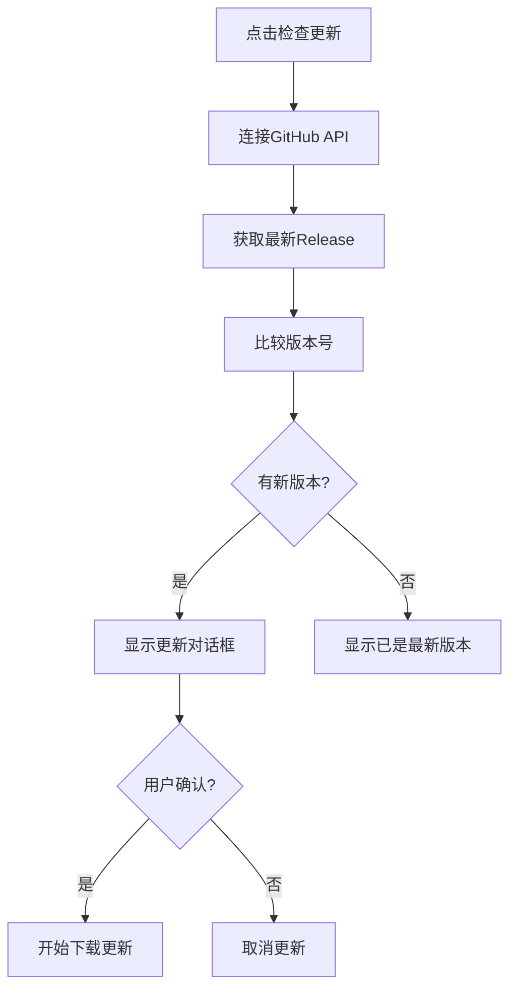
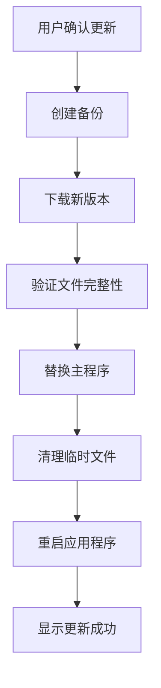

# 自动更新功能使用教程

## 一、功能概述

PDF重命名工具内置了完整的**企业级自动更新系统**，基于GitHub Releases API，提供以下核心功能：

### ✨ 主要特性
- **自动版本检查**：启动时自动检查GitHub仓库最新版本
- **智能下载管理**：支持断点续传、进度显示、完整性校验
- **安全备份恢复**：更新前自动备份，失败时自动恢复
- **用户友好界面**：清晰的更新提示和进度反馈
- **灵活配置选项**：支持禁用自动检查、调整检查间隔等

### 🔧 技术架构
- **更新源**：GitHub Releases
- **下载方式**：多线程下载 + 断点续传
- **安全机制**：SHA256完整性校验 + 自动备份
- **更新策略**：静默检查 + 用户确认

---

## 二、配置步骤

### 第一步：环境准备

#### 1.1 确认Python环境
```bash
# 确保Python 3.7+环境
python --version

# 安装必要的依赖包
pip install requests packaging PyQt5
```

#### 1.2 验证项目结构
确保以下文件和目录存在：
```
项目根目录/
├── auto_updater/                    # 自动更新模块
├── updater_config.json             # 主配置文件
├── PDF_Rename_Operation.py         # 主程序
├── signature_config.json           # 数字签名配置文件
└── requirements.txt                # 依赖包列表
```

### 第二步：GitHub仓库配置

#### 2.1 创建GitHub仓库
1. 在GitHub上创建公开仓库
2. 启用Releases功能
3. 配置仓库信息（owner和repo名称）

#### 2.2 配置主配置文件
编辑 `updater_config.json` 文件：

```json
{
  "app": {
    "name": "PDF重命名工具",
    "executable": "PDF_Rename_Operation.exe"
  },
  "repository": {
    "owner": "chen-huai",                    // 【修改】您的GitHub用户名
    "repo": "Temu_PDF_Rename_APP",           // 【修改】您的仓库名称
    "api_base": "https:// api.github.com"
  },
  "version": {
    "current": "2.0.0",                      // 【修改】当前版本号
    "check_interval_days": 30,               // 检查间隔（天）
    "auto_check_enabled": true               // 是否启用自动检查
  },
  "update": {
    "backup_count": 3,                       // 保留备份数量
    "download_timeout": 300,                 // 下载超时（秒）
    "max_retries": 3,                        // 最大重试次数
    "auto_restart": true                     // 是否自动重启
  }
}
```

**关键配置项说明**：
- `repository.owner`：GitHub仓库所有者用户名
- `repository.repo`：GitHub仓库名称
- `version.current`：当前应用程序版本号
- `version.auto_check_enabled`：是否启动时自动检查更新

### 第三步：版本管理设置

#### 3.1 Config类统一版本管理
版本信息现在通过 `auto_updater/config.py` 中的 Config 类进行统一管理：

- **版本存储**：版本号直接存储在 `updater_config.json` 的 `version.current` 字段
- **状态管理**：更新检查状态保存在 `update_state.json` 文件中
- **自动同步**：版本更新时自动同步到配置文件，无需手动维护多个文件

#### 3.2 版本号命名规范
- **格式**：`x.y.z`（如2.0.0、2.1.0等）
- **规则**：遵循语义化版本号规范
- **管理**：通过Config类的方法进行版本管理：
  ```python
  from auto_updater.config import get_config

  config = get_config()
  current_version = config.current_version
  is_newer = config.is_newer_version("v2.1.0", current_version)
  ```

#### 3.3 版本管理优势
- **配置驱动**：所有版本信息通过配置文件管理
- **状态持久化**：更新检查状态自动保存
- **架构简化**：无需维护独立的version.txt文件
- **模块独立**：auto_updater模块完全自包含

### 第四步：GitHub Release配置

#### 4.1 创建发布版本
1. 在GitHub仓库页面点击 "Releases"
2. 点击 "Create a new release"
3. 填写版本信息：
   - **Tag version**：`v2.0.0`（注意前面的v）
   - **Release title**：`版本 2.0.0`
   - **Description**：版本更新内容说明

#### 4.2 上传可执行文件
1. 在Release页面点击 "Attach binaries"
2. 上传打包后的可执行文件：
   - **文件名**：`PDF_Rename_Operation.exe`
   - **要求**：经过数字签名的可执行文件

#### 4.3 版本信息一致性
确保Release的tag名称与 `updater_config.json` 中的版本号一致：
- Release标签：`v2.0.0`
- 配置文件版本：`2.0.0`（无需v前缀）

---

## 三、使用流程

### 第一步：启动应用程序

#### 1.1 开发环境启动
```bash
# 直接运行Python脚本
python PDF_Rename_Operation.py
```

#### 1.2 生产环境启动
```bash
# 运行打包后的可执行文件
PDF_Rename_Operation.exe
```

### 第二步：自动更新检查（启动时）

#### 2.1 检查逻辑
- **检查条件**：仅在生产环境（打包为exe）中启用
- **检查频率**：根据配置的 `check_interval_days`（默认30天）
- **检查时机**：应用启动后延迟2秒执行

#### 2.2 检查结果处理
- **无更新**：静默跳过，用户无感知
- **有更新**：弹出确认对话框
- **检查失败**：记录日志，不影响正常使用

#### 2.3 更新确认对话框
```
发现新版本 v2.1.0
当前版本 v2.0.0

是否立即更新？

[是] [否]
```

### 第三步：手动检查更新

#### 3.1 通过菜单触发
1. 点击菜单栏 "更新" → "检查更新"
2. 系统立即连接GitHub API检查版本
3. 显示检查结果

#### 3.2 手动检查流程


### 第四步：更新过程操作

#### 4.1 下载阶段
- **进度显示**：实时显示下载进度条
- **断点续传**：支持网络中断后继续下载
- **完整性校验**：下载完成后验证SHA256哈希值

#### 4.2 备份阶段
- **自动备份**：在更新前自动备份当前版本
- **备份位置**：`backup/` 目录
- **备份命名**：`PDF_Rename_Operation_v2.0.0_backup.exe`

#### 4.3 更新执行
- **文件替换**：用新版本替换主程序文件
- **权限处理**：自动处理文件占用情况
- **重启应用**：更新完成后自动重启到新版本

#### 4.4 完整更新流程


---

## 四、故障排除

### 常见问题及解决方案

#### 1. 更新检查失败

**问题现象**：
- 启动时没有更新提示
- 手动检查显示连接失败

**可能原因**：
- 网络连接问题
- GitHub仓库配置错误
- API访问限制

**解决步骤**：
```bash
# 1. 检查网络连接
ping github.com

# 2. 验证仓库配置
# 检查 updater_config.json 中的 owner 和 repo 是否正确

# 3. 测试API访问
curl https://api.github.com/repos/chen-huai/Temu_PDF_Rename_APP/releases/latest

# 4. 检查版本号格式
# 确保 updater_config.json 中版本号与 GitHub Release tag 一致
```

#### 2. 下载失败

**问题现象**：
- 下载进度条停止
- 提示下载超时或失败

**可能原因**：
- 网络不稳定
- 服务器响应慢
- 磁盘空间不足

**解决步骤**：
1. **检查网络连接**：确保网络稳定
2. **增加超时时间**：修改 `download_timeout` 配置
3. **清理磁盘空间**：确保有足够空间存放更新文件
4. **手动下载**：直接从GitHub Release页面下载

#### 3. 更新失败

**问题现象**：
- 更新过程中提示失败
- 程序无法启动

**解决步骤**：
1. **查看日志**：检查应用日志了解具体错误
2. **手动恢复备份**：
   ```bash
   # 进入backup目录
   cd backup/
   # 找到最新备份文件
   PDF_Rename_Operation_v2.0.0_backup.exe
   # 复制到主目录替换损坏文件
   ```
3. **重新下载**：删除损坏文件，重新执行更新

#### 4. 版本号不一致

**问题现象**：
- 提示版本校验失败
- 更新流程中断

**解决步骤**：
1. **统一版本号**：
   ```bash
   # 确保以下文件中版本号一致：
   # 1. updater_config.json 中的 "current" 字段
   # 2. GitHub Release 的 tag 名称
   ```

2. **验证格式**：
   - 版本号格式：`x.y.z`
   - Release标签：`vx.y.z`

3. **使用Config类管理版本**：
   ```python
   from auto_updater.config import get_config

   config = get_config()
   config.update_current_version("2.1.0")  # 更新版本号
   ```

### 调试工具

#### 1. 更新功能测试脚本
```bash
# 运行测试脚本
python test_update.py
```

**测试内容**：
- 模块导入测试
- 版本管理器测试
- GitHub连接测试
- 自动更新器测试

#### 2. 版本管理工具
```bash
# 更新版本号
python update_version.py 2.1.0

# 验证版本一致性
python update_version.py --verify
```

#### 3. 手动检查API
```bash
# 使用curl测试GitHub API
curl -H "Accept: application/vnd.github.v3+json" \
     https://api.github.com/repos/chen-huai/Temu_PDF_Rename_APP/releases/latest
```

---

## 五、高级配置

### 1. 禁用自动更新
```json
{
  "version": {
    "auto_check_enabled": false
  }
}
```

### 2. 调整检查频率
```json
{
  "version": {
    "check_interval_days": 7  // 每7天检查一次
  }
}
```

### 3. 增加备份数量
```json
{
  "update": {
    "backup_count": 5  // 保留5个备份版本
  }
}
```

### 4. 自定义下载超时
```json
{
  "update": {
    "download_timeout": 600  // 10分钟超时
  }
}
```

---

## 六、维护建议

### 定期维护任务

1. **每月检查**：
   - 验证GitHub仓库访问正常
   - 确认Release文件完整性
   - 检查版本号一致性

2. **版本发布时**：
   - 更新所有版本号
   - 创建GitHub Release
   - 上传签名的可执行文件
   - 测试更新流程

3. **故障处理**：
   - 监控更新成功率
   - 定期清理旧备份
   - 记录常见问题解决方案

### 备份策略

- **自动备份**：系统自动保留最近3个版本
- **手动备份**：重要更新前手动备份
- **离线备份**：保留离线安装包

---

## 七、联系方式

如果在配置或使用过程中遇到问题，请：

1. **查看日志**：检查应用程序日志了解详细错误信息
2. **参考故障排除**：按照第四部分的步骤进行排查
3. **测试工具**：使用 `test_update.py` 脚本诊断问题
4. **GitHub Issues**：在项目仓库提交Issue

---

**更新日期**：2025-10-27
**适用版本**：v2.0.0+
**文档版本**：1.0