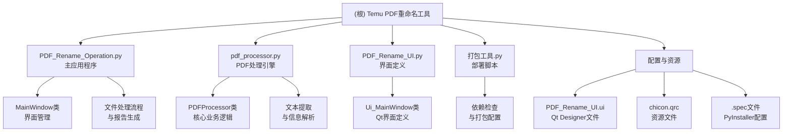
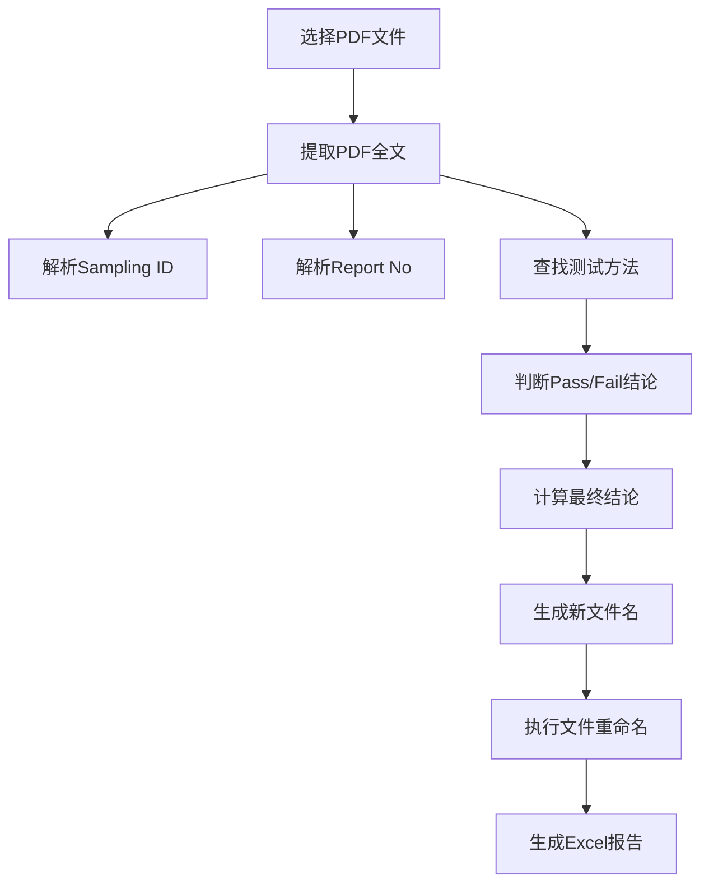

# CLAUDE.md

**[根目录](./CLAUDE.md)**

## 变更记录 (Changelog)

- **2025-10-16 09:10:18** - 完成架构分析和文档初始化，添加模块结构图和详细模块文档
- **原有版本** - 基础项目文档

## 项目愿景

为Temu PDF处理工作流程提供高效、准确的批量重命名工具，自动化提取PDF关键信息并按标准命名约定重命名文件，大幅提升工作效率。

## 架构总览

### 技术栈
- **界面框架**: PyQt5 (桌面GUI应用)
- **PDF处理**: PyPDF2 (文本提取)
- **数据处理**: pandas (Excel报告生成)
- **打包工具**: PyInstaller (可执行文件生成)

### 架构模式
采用**界面与业务逻辑分离**的架构模式：
- **表示层**: PyQt5界面组件
- **业务层**: pdf_processor核心处理引擎
- **工具层**: 打包和部署脚本

### 设计原则
- **单一职责**: 每个模块专注特定功能
- **松耦合**: 界面与业务逻辑独立
- **错误处理**: 完善的异常处理和用户反馈
- **用户体验**: 直观的操作界面和实时进度反馈

## ✨ 模块结构图



## 模块索引

| 模块名称 | 文件路径 | 类型 | 主要职责 | 入口文件 |
|---------|---------|------|---------|---------|
| **主应用程序** | `PDF_Rename_Operation.py` | 核心模块 | GUI界面管理、用户交互、流程控制 | ✅ 是 |
| **PDF处理引擎** | `pdf_processor.py` | 核心模块 | PDF文本提取、信息解析、重命名逻辑 | ❌ 否 |
| **界面定义** | `PDF_Rename_UI.py` | 支持模块 | Qt界面布局、UI组件定义 | ❌ 否 |
| **打包工具** | `打包工具.py` | 工具模块 | 依赖管理、应用打包、便携版创建 | ❌ 否 |
| **UI设计文件** | `PDF_Rename_UI.ui` | 资源文件 | Qt Designer可视化设计 | ❌ 否 |
| **资源文件** | `chicon.qrc/.py` | 资源文件 | 应用程序图标资源 | ❌ 否 |

## 运行与开发

### 环境要求
```bash
Python 3.7+
PyQt5 >= 5.15.0
PyPDF2 >= 3.0.0
pandas >= 1.3.0
```

### 开发命令
```bash
# 运行主应用程序
python PDF_Rename_Operation.py

# 编辑界面(需要Qt Designer)
# 打开 PDF_Rename_UI.ui

# 重新生成UI代码
pyuic5 -x PDF_Rename_UI.ui -o PDF_Rename_UI.py

# 重新生成资源文件
pyrcc5 chicon.qrc -o chicon_rc.py

# 打包应用程序
python 打包工具.py
```

### 默认配置
- **输出目录**: `C:\Users\chen-fr\Desktop\test\1`
- **默认测试方法**: `Total Lead Content Test;Total Cadmium Content Test;Nickel Release Test`
- **文件命名格式**: `Sampling ID-Report No-结论.pdf`

## 测试策略

### 功能测试
- **测试方法按钮**: 对第一个PDF文件进行试运行，不实际重命名
- **批量处理**: 支持多文件同时处理
- **错误处理**: 文件不存在、PDF加密、提取失败等异常场景

### 测试流程
1. 启动应用程序
2. 输入测试方法列表（分号分隔）
3. 选择要处理的PDF文件
4. 点击"测试方法"验证提取逻辑
5. 确认无误后点击"重命名"执行批量处理

## 编码规范

### 代码风格
- **编码**: UTF-8
- **缩进**: 4个空格
- **命名**: 驼峰命名法（类）、下划线命名法（函数/变量）
- **文档**: 每个模块和主要函数包含中文文档字符串

### 架构约束
- **UI与业务分离**: UI文件自动生成，不手动修改
- **模块化设计**: 核心业务逻辑独立成模块
- **错误处理**: 所有外部操作包含try-catch处理
- **日志记录**: 关键操作和错误信息记录到日志

## AI 使用指引

### 代码修改指导原则
1. **优先修改业务逻辑**: pdf_processor.py是核心模块
2. **谨慎修改UI**: 通过修改.ui文件而非.py文件
3. **保持向后兼容**: 确保现有功能不受影响
4. **添加测试覆盖**: 新功能应包含相应的测试逻辑

### 常见任务指引
- **添加新的测试方法**: 修改pdf_processor.py中的结论关键词列表
- **修改输出格式**: 调整generate_new_filename方法
- **优化提取逻辑**: 改进_extract_开头的各个提取方法
- **界面调整**: 使用Qt Designer修改.ui文件

## 核心业务流程

### PDF处理工作流


### 信息提取规则
- **Sampling ID**: 查找"Sampling ID:"后的内容
- **Report No**: 查找"Report No.:"后的内容
- **测试结论**: 在测试方法后15行内查找Pass/Fail关键词
- **最终结论**: 任一测试Fail则整体Fail，否则Pass

## 项目特色

### 智能信息提取
- 支持多页面PDF全文扫描
- 多种格式和语言的结论关键词识别
- 容错性强的正则表达式匹配

### 用户友好设计
- 实时处理进度显示
- 详细的操作日志和错误反馈
- 测试模式验证提取逻辑

### 生产就绪
- 完善的错误处理机制
- 支持加密PDF处理尝试
- Excel报告便于后续分析

## 部署与分发

### 打包配置
- **打包工具**: PyInstaller
- **输出格式**: 单文件可执行程序
- **目标平台**: Windows桌面应用
- **图标资源**: 自定义应用图标

### 分发包结构
```
PDF重命名工具_便携版/
├── PDF_Rename_Operation.exe  # 主程序
└── 使用说明.txt              # 用户指南
```

## 详细功能说明

### PDF处理工作流程
- 选择多个PDF文件进行处理
- 从PDF所有页面提取文本内容
- 提取关键信息：
  - Sampling ID：使用多种模式匹配
  - Report No：支持多种报告编号格式
  - 测试方法和结论：根据用户输入的测试方法列表
- 判断最终结论：只要有一个测试方法为fail，最终结论即为fail
- 生成新文件名：`Sampling ID-Report No-最终结论.pdf`
- 在原始位置重命名文件（不移动到其他文件夹）
- 在指定目录生成带时间戳的Excel报告

### 文件命名约定
- 输入：原始PDF文件名
- 输出：`Sampling ID-Report No-pass.pdf` 或 `Sampling ID-Report No-fail.pdf`
- 如果无法提取信息，使用默认值：`UNKNOWN_SAMPLING_ID-UNKNOWN_REPORT_NO-fail.pdf`

### 测试方法处理
- 用户在lineEdit中输入测试方法，用分号分隔
- 例如：`Total Lead Content Test;Total Cadmium Content Test`
- 系统为每个测试方法查找对应的pass/fail结论
- 支持多种语言的结论关键词（中英文）

## 重要注意事项

- 主程序文件是`PDF_Rename_Operation.py`，包含完整的业务逻辑
- PDF处理核心逻辑在`pdf_processor.py`模块中
- UI文件（`PDF_Rename_UI.py`）是自动生成的，手动修改会丢失
- 编辑UI时，请修改`.ui`文件然后用pyuic5重新生成Python代码
- 应用程序会处理PDF的所有页面，不限于第一页
- Excel报告使用时间戳命名，避免覆盖之前的结果
- 单线程处理模式，确保稳定性
- 结论判断规则：只要有一个测试方法为fail，最终结论即为fail
- 支持中英文结论关键词识别
- 文件重命名格式：`Sampling ID-Report No-最终结论.pdf`
- 支持加密PDF的文本提取尝试

## 核心算法详解

### PDF Information Extraction

**Sampling ID提取逻辑 (pdf_processor.py:193-221):**
- 按行扫描PDF文本内容
- 查找包含"Sampling ID:"的行
- 使用正则表达式提取冒号后的值
- 清理特殊字符，保留字母数字和常用符号

**Report No提取逻辑 (pdf_processor.py:223-250):**
- 类似Sampling ID的提取方式
- 查找包含"Report No.:"的行
- 支持多种报告编号格式

**测试结果判断逻辑 (pdf_processor.py:252-382):**
- 按行处理，查找用户指定的测试方法
- 向下搜索15行内的Pass/Fail关键词
- 支持中英文关键词：pass/fail, 符合/不符合, 合格/不合格等
- 智能判断最终结论（任一Fail则整体Fail）

### Error Handling

应用程序具有完善的错误处理机制：
- 文件存在性检查
- PDF加密处理尝试
- 文本提取失败处理
- 文件重命名冲突检测
- 详细的日志记录