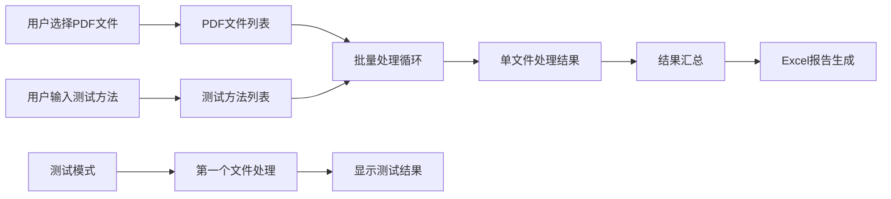

# CLAUDE.md - PDF_Rename_Operation 模块

**[根目录](../../CLAUDE.md) > [PDF_Rename_Operation](../) > **PDF_Rename_Operation**

## 变更记录 (Changelog)

- **2025-10-16 09:10:18** - 创建模块文档，详细分析主应用程序架构和功能

## 模块职责

PDF_Rename_Operation.py 是Temu PDF重命名工具的**主应用程序入口**，负责：

- **用户界面管理**: 创建和主窗口，管理用户交互
- **业务流程编排**: 协调PDF处理、文件重命名和报告生成
- **用户操作处理**: 响应文件选择、测试方法、重命名等用户操作
- **进度反馈**: 实时显示处理进度和结果信息
- **Excel报告生成**: 汇总处理结果并生成带时间戳的Excel报告

## 入口与启动

### 应用程序入口点
```python
def main():
    """主函数"""
    app = QApplication(sys.argv)
    app.setApplicationName("PDF重命名工具")
    app.setOrganizationName("Temu")

    window = MainWindow()
    window.show()

    sys.exit(app.exec_())

if __name__ == "__main__":
    main()
```

### 启动命令
```bash
python PDF_Rename_Operation.py
```

## 对外接口

### MainWindow 类 - 主窗口控制器

#### 核心方法接口

| 方法名 | 参数 | 返回值 | 功能描述 |
|--------|------|--------|----------|
| `select_files()` | 无 | None | 打开文件选择对话框，支持多选PDF文件 |
| `rename_files()` | 无 | None | 执行批量PDF重命名操作 |
| `test_method()` | 无 | None | 测试模式：对第一个PDF进行试运行 |
| `process_single_file(pdf_path)` | `pdf_path: str` | `Dict` | 处理单个PDF文件的完整流程 |
| `generate_excel_report(results)` | `results: List[Dict]` | None | 生成Excel处理报告 |

#### 信号连接
```python
# UI事件绑定
self.pushButton_2.clicked.connect(self.select_files)      # 选择文件按钮
self.pushButton_3.clicked.connect(self.rename_files)      # 重命名按钮
self.pushButton.clicked.connect(self.test_method)         # 测试方法按钮
```

### 处理结果数据结构
```python
{
    'original_name': str,      # 原始文件名
    'new_name': str,           # 新文件名
    'sampling_id': str,        # 提取的Sampling ID
    'report_no': str,          # 提取的Report No
    'test_results': dict,      # 各测试方法的结果
    'final_conclusion': str,   # 最终结论(Pass/Fail/未找到结论)
    'rename_success': bool,    # 重命名是否成功
    'error': str              # 错误信息(如有)
}
```

## 关键依赖与配置

### 核心依赖
- **PyQt5**: GUI框架和界面组件
- **pdf_processor**: 自定义PDF处理引擎
- **pandas**: Excel报告生成
- **os, sys**: 系统操作和文件路径处理
- **logging**: 日志记录

### 配置常量
```python
# 默认输出目录
self.output_dir = r"C:\Users\chen-fr\Desktop\test\1"

# 默认文件选择目录
default_dir = r"N:\XM Softlines\6. Personel\6. Daily Priority Testing List"
```

### 业务逻辑依赖
```python
from pdf_processor import PDFProcessor
self.processor = PDFProcessor()  # PDF处理引擎实例
```

## 数据模型

### PDF处理流程数据流


### Excel报告数据模型
```python
# 报告列结构
report_columns = [
    '原始文件名', '新文件名', 'Sampling ID', 'Report No',
    '最终结论', '重命名状态'
]

# 动态测试列（根据用户输入的测试方法生成）
for test_method in test_methods:
    report_columns.append(f"测试_{test_method}")

# 错误信息列（如有）
report_columns.append('错误信息')
```

## 测试与质量

### 功能测试要点

#### 1. 用户界面测试
- [ ] 文件选择对话框正常打开
- [ ] 支持多文件选择
- [ ] 测试方法输入框接受分号分隔的输入
- [ ] 按钮状态正确启用/禁用

#### 2. 业务流程测试
- [ ] 测试模式只处理第一个文件
- [ ] 批量处理按顺序处理所有文件
- [ ] 进度信息实时更新
- [ ] 错误信息正确显示

#### 3. 数据处理测试
- [ ] PDF处理结果正确传递
- [ ] Excel报告格式正确
- [ ] 时间戳文件名生成
- [ ] 错误情况处理

### 错误处理机制
```python
# 文件操作异常处理
try:
    # PDF处理和重命名逻辑
    result = self.process_single_file(pdf_path)
    results.append(result)
except Exception as e:
    logger.error(f"处理过程中发生错误: {e}")
    self.textBrowser.append(f"处理过程中发生错误: {e}")

# 用户体验保护
if reply != QMessageBox.Yes:
    return  # 用户取消操作
```

### 日志记录
```python
logging.basicConfig(level=logging.DEBUG, format='%(asctime)s - %(levelname)s - %(message)s')
logger = logging.getLogger(__name__)

# 关键操作日志
logger.info("主窗口初始化完成")
logger.info(f"选择了 {len(files)} 个PDF文件")
logger.info(f"成功重命名: {os.path.basename(old_path)} -> {new_filename}")
```

## 常见问题 (FAQ)

### Q1: 应用程序启动后界面显示异常
**A**: 检查PyQt5是否正确安装，确保所有依赖模块都在Python路径中。

### Q2: 文件选择对话框无法打开
**A**: 确认default_dir路径存在，或修改为合适的默认路径。

### Q3: Excel报告生成失败
**A**: 检查pandas库是否安装，确认输出目录有写入权限。

### Q4: 处理大量文件时界面卡顿
**A**: 当前使用单线程处理，如需优化可考虑添加进度条和多线程处理。

### Q5: 测试模式与正式处理结果不一致
**A**: 测试模式只处理第一个文件且不执行重命名，这是正常行为。

## 相关文件清单

### 主要文件
- `PDF_Rename_Operation.py` (341行) - 主应用程序文件

### 依赖模块
- `pdf_processor.py` - PDF处理引擎
- `PDF_Rename_UI.py` - UI界面定义
- `chicon_rc.py` - 资源文件

### 配置文件
- `PDF_Rename_Operation.spec` - PyInstaller配置

### 输出文件
- `C:\Users\chen-fr\Desktop\test\1\pdf_rename_report_YYYYMMDD_HHMMSS.xlsx` - 处理报告

## 性能考虑

### 处理效率
- **当前模式**: 单线程顺序处理，确保稳定性
- **文件数量**: 建议单次处理不超过100个文件
- **PDF大小**: 大文件处理时间较长，建议耐心等待

### 内存使用
- **PDF文本**: 全文加载到内存中进行解析
- **结果缓存**: 处理结果暂存内存中，最后统一写入Excel
- **界面更新**: 使用QApplication.processEvents()保持界面响应

### 扩展建议
1. **多线程处理**: 可添加后台处理线程
2. **进度条**: 显示更精确的处理进度
3. **批量暂停**: 添加暂停/继续功能
4. **配置文件**: 将硬编码配置提取到配置文件