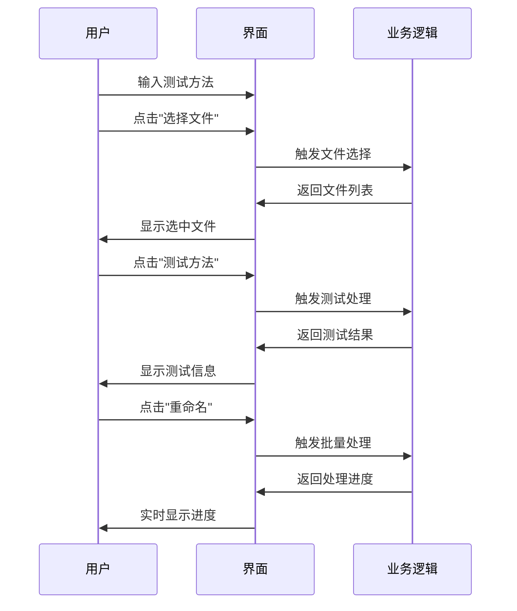

# CLAUDE.md - PDF_Rename_UI 模块

**[根目录](../../CLAUDE.md) > [PDF_Rename_UI](../) > **PDF_Rename_UI**

## 变更记录 (Changelog)

- **2025-10-16 09:10:18** - 创建模块文档，详细分析UI界面定义和设计规范

## 模块职责

PDF_Rename_UI.py 是Temu PDF重命名工具的**界面定义模块**，负责：

- **界面布局定义**: 主窗口结构和组件布局
- **UI组件创建**: 按钮、输入框、文本显示等界面元素
- **资源集成**: 应用程序图标和界面资源
- **多语言支持**: 界面文本的国际化设置

## 入口与启动

### 自动生成文件
⚠️ **重要提示**: 此文件由Qt Designer自动生成，**不应手动编辑**！

如需修改界面，请按以下步骤操作：

1. **编辑UI设计文件**: `PDF_Rename_UI.ui` (使用Qt Designer)
2. **重新生成Python代码**:
   ```bash
   pyuic5 -x PDF_Rename_UI.ui -o PDF_Rename_UI.py
   ```

### 类结构
```python
class Ui_MainWindow(object):
    def setupUi(self, MainWindow):
        """设置主窗口UI"""

    def retranslateUi(self, MainWindow):
        """界面文本翻译和本地化"""
```

## 对外接口

### 主要UI组件

| 组件名 | 类型 | 变量名 | 功能描述 |
|--------|------|--------|----------|
| 主窗口 | QMainWindow | MainWindow | 应用程序主窗口 |
| 标签页控件 | QTabWidget | tabWidget | 容纳主要功能标签页 |
| 操作按钮 | QPushButton | pushButton | "测试方法"按钮 |
| 文件选择按钮 | QPushButton | pushButton_2 | "选择文件"按钮 |
| 重命名按钮 | QPushButton | pushButton_3 | "重命名"按钮 |
| 测试方法输入框 | QLineEdit | lineEdit | 输入测试方法列表 |
| 信息显示区域 | QTextBrowser | textBrowser | 显示处理结果和进度 |

### 界面布局层次结构
```mermaid
graph TD
    A[MainWindow] --> B[centralwidget]
    B --> C[verticalLayout]
    C --> D[tabWidget]
    D --> E[tab - "Temu"]
    E --> F[verticalLayout_2]
    F --> G[groupBox - "操作"]
    G --> H[gridLayout_2]
    H --> I[pushButton - "测试方法"]
    H --> J[lineEdit - 测试方法输入]
    H --> K[pushButton_2 - "选择文件"]
    H --> L[pushButton_3 - "重命名"]
    F --> M[groupBox_2 - "信息"]
    M --> N[gridLayout]
    N --> O[textBrowser - 信息显示]

    A --> P[menubar]
    A --> Q[statusbar]
```

## 关键依赖与配置

### 核心依赖
- **PyQt5**: GUI框架和界面组件
- **chicon_rc**: 应用程序图标资源

### 界面配置
```python
# 窗口配置
MainWindow.resize(793, 600)  # 窗口大小
MainWindow.setWindowTitle("PDF")  # 窗口标题

# 图标配置
icon = QtGui.QIcon()
icon.addPixmap(QtGui.QPixmap("ch.ico"), QtGui.QIcon.Normal, QtGui.QIcon.Off)
MainWindow.setWindowIcon(icon)
```

### 默认值配置
```python
# 默认测试方法列表
self.lineEdit.setText(_translate("MainWindow",
    "Total Lead Content Test;Total Cadmium Content Test;Nickel Release Test"))

# 按钮初始状态
self.pushButton.setEnabled(False)  # 测试方法按钮初始禁用
```

## 数据模型

### 用户交互流程


### 界面状态模型
```python
# 界面状态
states = {
    'initial': {
        'test_button_enabled': False,
        'files_selected': False,
        'processing': False
    },
    'files_selected': {
        'test_button_enabled': True,
        'processing': False
    },
    'processing': {
        'test_button_enabled': False,
        'files_button_enabled': False,
        'rename_button_enabled': False,
        'processing': True
    },
    'completed': {
        'test_button_enabled': True,
        'files_button_enabled': True,
        'rename_button_enabled': True,
        'processing': False
    }
}
```

## 测试与质量

### 界面测试要点

#### 1. 组件功能测试
- [ ] 所有按钮点击响应正常
- [ ] 输入框接受文本输入
- [ ] 文本显示区域正确显示信息
- [ ] 窗口大小调整正常

#### 2. 布局测试
- [ ] 界面组件布局合理
- [ ] 窗口缩小时组件正确重排
- [ ] 不同分辨率下显示正常
- [ ] 标签页切换正常

#### 3. 资源测试
- [ ] 应用程序图标正确显示
- [ ] 界面字体显示正常
- [ ] 多语言文本正确显示

### 代码质量
```python
# 自动生成代码特点
# 1. 标准的Qt代码结构
# 2. 统一的命名规范
# 3. 完整的组件属性设置
# 4. 支持国际化的文本处理

# 示例：按钮创建
self.pushButton = QtWidgets.QPushButton(self.groupBox)
self.pushButton.setEnabled(False)  # 初始状态设置
self.pushButton.setObjectName("pushButton")  # 对象名称设置
```

## 常见问题 (FAQ)

### Q1: 修改界面后没有生效
**A**: 确保修改了`.ui`文件后重新运行`pyuic5`命令生成Python代码。

### Q2: 界面显示异常或组件错位
**A**: 检查Qt Designer中的布局设置，确保使用了合适的布局管理器。

### Q3: 图标不显示
**A**: 确认`ch.ico`文件存在，检查`chicon_rc.py`是否正确生成。

### Q4: 界面文本显示乱码
**A**: 确保文件保存为UTF-8编码，检查系统的字体支持。

### Q5: 界面响应缓慢
**A**: UI本身是轻量级的，响应缓慢可能来自业务逻辑处理，检查主程序代码。

## 相关文件清单

### 主要文件
- `PDF_Rename_UI.py` (87行) - 自动生成的UI代码
- `PDF_Rename_UI.ui` - Qt Designer设计文件

### 资源文件
- `chicon.qrc` - Qt资源定义文件
- `chicon_rc.py` - 编译后的资源文件
- `ch.ico` - 应用程序图标

### 依赖文件
- `PDF_Rename_Operation.py` - 主程序(使用此UI)
- `PyQt5` - GUI框架库

## 界面设计规范

### 命名规范
```python
# Qt Designer自动命名规范
# pushButton, pushButton_2, pushButton_3... - 按钮组件
# lineEdit - 单行文本输入框
# textBrowser - 多行文本显示区域
# groupBox - 分组容器
# tabWidget - 标签页容器
# verticalLayout, gridLayout - 布局管理器
```

### 布局原则
1. **响应式设计**: 使用布局管理器而非固定位置
2. **逻辑分组**: 使用GroupBox对相关功能进行分组
3. **一致性**: 保持组件间距和对齐方式一致
4. **可访问性**: 设置合适的对象名称和提示文本

### 国际化支持
```python
def retranslateUi(self, MainWindow):
    _translate = QtCore.QCoreApplication.translate
    # 所有界面文本通过_translate函数处理
    MainWindow.setWindowTitle(_translate("MainWindow", "PDF"))
    self.groupBox.setTitle(_translate("MainWindow", "操作"))
    # 这样设计便于后续添加多语言支持
```

## 定制与扩展

### 添加新组件步骤
1. 在Qt Designer中打开`PDF_Rename_UI.ui`
2. 从组件面板拖拽新组件到界面
3. 设置组件属性和布局
4. 保存`.ui`文件
5. 重新生成Python代码：
   ```bash
   pyuic5 -x PDF_Rename_UI.ui -o PDF_Rename_UI.py
   ```

### 界面主题定制
```python
# 可以在主程序中设置样式表
app.setStyleSheet("""
    QMainWindow {
        background-color: #f0f0f0;
    }
    QPushButton {
        background-color: #4CAF50;
        color: white;
        border: none;
        padding: 8px 16px;
    }
    QPushButton:hover {
        background-color: #45a049;
    }
""")
```

### 响应式布局优化
- 使用`QSizePolicy`设置组件的伸缩策略
- 合理设置最小和最大尺寸
- 利用`stretch`属性控制布局比例分配

## 性能考虑

### UI性能特点
- **轻量级**: 界面组件数量适中，启动快速
- **资源占用**: 图标资源经过压缩，内存占用小
- **响应性**: 布局管理器确保界面重绘高效

### 优化建议
1. **延迟加载**: 复杂组件可考虑延迟初始化
2. **样式缓存**: 如使用自定义样式，建议缓存样式表
3. **事件处理**: 避免在UI线程中执行耗时操作

### 未来扩展方向
1. **多标签页**: 可添加更多功能标签页
2. **工具栏**: 添加常用操作的工具栏
3. **状态栏**: 显示更详细的状态信息
4. **设置界面**: 添加配置和设置对话框