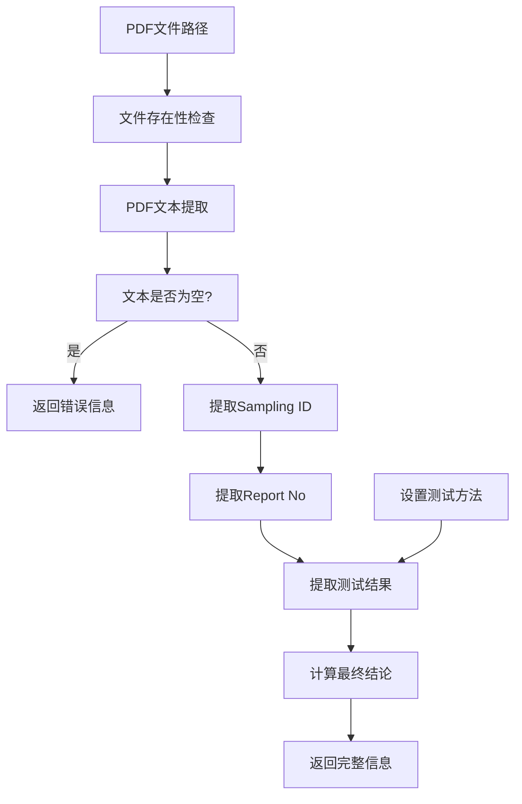
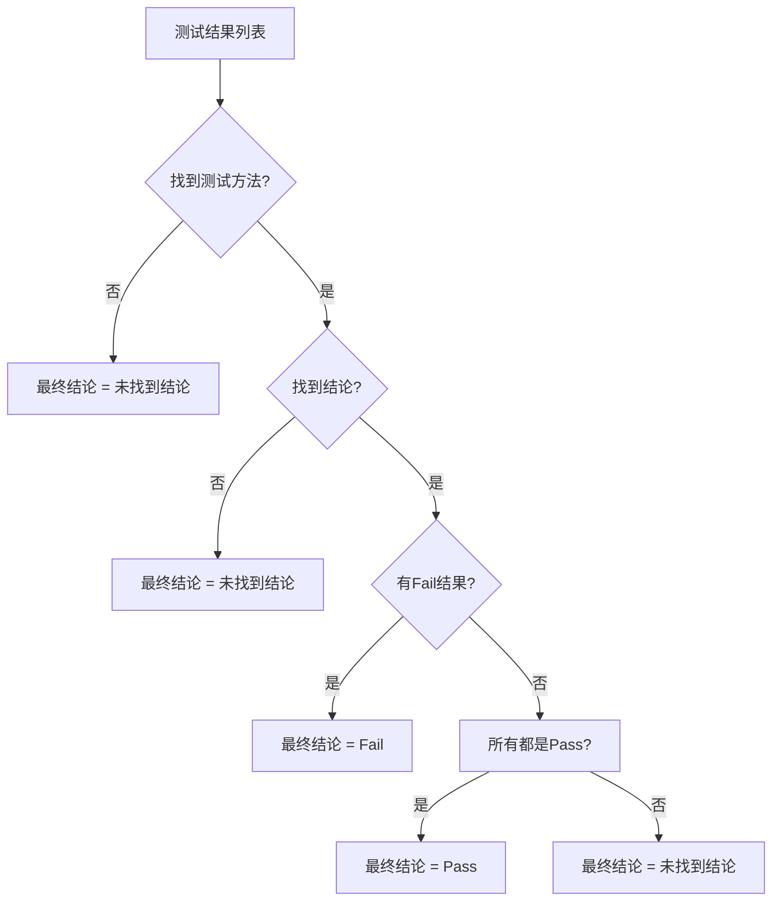

# CLAUDE.md - pdf_processor 模块

**[根目录](../../CLAUDE.md) > [pdf_processor](../) > **pdf_processor**

## 变更记录 (Changelog)

- **2025-10-16 09:10:18** - 创建模块文档，详细分析PDF处理引擎架构和算法

## 模块职责

pdf_processor.py 是Temu PDF重命名工具的**核心业务引擎**，负责：

- **PDF文本提取**: 从PDF所有页面提取可读文本内容
- **关键信息解析**: 智能提取Sampling ID、Report No等标识信息
- **测试结果判断**: 根据用户指定的测试方法查找Pass/Fail结论
- **文件名生成**: 按标准格式生成新的PDF文件名
- **错误处理**: 处理PDF加密、文本提取失败等异常情况

## 入口与启动

### 核心类 - PDFProcessor
```python
class PDFProcessor:
    """PDF处理类，负责提取PDF信息和重命名"""

    def __init__(self):
        self.test_methods = []
```

### 使用方式
```python
from pdf_processor import PDFProcessor

# 创建处理器实例
processor = PDFProcessor()

# 设置测试方法
processor.set_test_methods("Total Lead Content Test;Total Cadmium Content Test")

# 提取PDF信息
info = processor.extract_pdf_info("sample.pdf")

# 生成新文件名
new_name = processor.generate_new_filename(
    info['sampling_id'],
    info['report_no'],
    info['final_conclusion']
)
```

## 对外接口

### PDFProcessor 类主要方法

| 方法名 | 参数 | 返回值 | 功能描述 |
|--------|------|--------|----------|
| `set_test_methods(methods_str)` | `methods_str: str` | None | 设置测试方法列表（分号分隔） |
| `extract_pdf_info(pdf_path)` | `pdf_path: str` | `Dict` | 提取PDF完整信息（核心方法） |
| `generate_new_filename(sampling_id, report_no, conclusion)` | `sampling_id, report_no, conclusion: str` | `str` | 生成标准格式的文件名 |

### 核心数据结构
```python
# PDF信息提取结果
{
    'sampling_id': str,        # Sampling ID (可为None)
    'report_no': str,          # Report No (可为None)
    'test_results': dict,      # 测试方法结果映射
    'final_conclusion': str,   # 最终结论
    'error': str              # 错误信息(成功时为None)
}

# 测试结果示例
{
    'Total Lead Content Test': 'Pass',
    'Total Cadmium Content Test': 'Fail',
    'Nickel Release Test': '未找到方法'
}
```

## 关键依赖与配置

### 核心依赖
- **PyPDF2**: PDF文本提取和页面处理
- **re**: 正则表达式模式匹配
- **logging**: 详细的处理日志记录
- **os**: 文件系统操作

### 结论关键词配置
```python
# Pass关键词 (多语言支持)
pass_keywords = [
    'pass', 'compliant', '符合', '合格', '通过', 'ok', 'yes'
]

# Fail关键词 (优先级更高)
fail_keywords = [
    'fail', 'non-compliant', '不符合', '不合格', '不通过', 'failed', 'no', 'ng'
]
```

### 提取模式配置
```python
# Sampling ID提取模式
sampling_pattern = r'Sampling\s*ID\s*:\s*(.+)'

# Report No提取模式
report_pattern = r'Report\s*No\.?\s*:\s*(.+)'

# 结论查找范围
conclusion_search_range = 15  # 行数
```

## 数据模型

### PDF处理流程


### 最终结论判断逻辑


## 测试与质量

### 核心算法测试

#### 1. 文本提取测试
```python
# 测试用例：加密PDF处理
def test_encrypted_pdf():
    processor = PDFProcessor()
    info = processor.extract_pdf_info("encrypted_sample.pdf")
    assert info['error'] is not None  # 应该有错误信息
```

#### 2. 信息提取测试
```python
# 测试用例：Sampling ID提取
def test_sampling_id_extraction():
    text = "Sampling ID: TEST-2024-001\nOther content..."
    sampling_id = processor._extract_sampling_id(text)
    assert sampling_id == "TEST-2024-001"
```

#### 3. 结论判断测试
```python
# 测试用例：混合结论
def test_mixed_conclusions():
    test_results = {
        'Test A': 'Pass',
        'Test B': 'Fail',  # 有一个Fail
        'Test C': 'Pass'
    }
    # 最终结论应该是Fail
```

### 错误处理机制

#### PDF提取错误处理
```python
def _handle_error(self, error: Exception) -> str:
    """处理错误信息"""
    error_msg = str(error)

    if "PyCryptodome" in error_msg:
        return "PDF文件需要PyCryptodome库来处理加密"
    elif "encrypted" in error_msg.lower():
        return "PDF文件已加密，请提供无密码的PDF文件"
    elif "Empty" in error_msg or "no pages" in error_msg.lower():
        return "PDF文件为空或无页面"
    else:
        return error_msg
```

#### 文本提取容错
```python
# 加密PDF重试机制
try:
    with open(pdf_path, 'rb') as file:
        pdf_reader = PyPDF2.PdfReader(file)
        # 正常提取流程
except Exception as e:
    if "encrypted" in str(e).lower():
        # 对加密PDF的额外处理尝试
        try:
            # 尝试直接读取所有页面
            pass
        except Exception as retry_e:
            logger.error(f"从加密PDF提取文本也失败: {retry_e}")
```

### 日志记录策略
```python
# 调试级别日志
logger.debug(f"PDF总页数: {page_count}")
logger.debug(f"第 {i+1} 页提取成功，文本长度: {len(page_text)}")

# 信息级别日志
logger.info(f"设置测试方法: {self.test_methods}")
logger.info(f"提取完成: Sampling ID={sampling_id}, Report No={report_no}")

# 警告级别日志
logger.warning(f"第 {i+1} 页文本为空")
logger.warning("未找到Sampling ID")

# 错误级别日志
logger.error(f"处理PDF失败: {error_msg}")
```

## 常见问题 (FAQ)

### Q1: PDF文本提取返回空字符串
**A**: 可能是扫描版PDF或加密PDF，检查PDF是否包含可提取的文本内容。

### Q2: Sampling ID或Report No提取失败
**A**: 确认PDF中的格式符合预期模式，检查关键词拼写和格式是否正确。

### Q3: 测试结果都是"未找到方法"
**A**: 验证输入的测试方法名称是否与PDF中的完全匹配，注意大小写和空格。

### Q4: 结论判断不准确
**A**: 检查结论关键词列表是否包含PDF中使用的词汇，可考虑添加更多语言变体。

### Q5: 处理大文件时内存占用过高
**A**: 当前实现全文加载到内存，可优化为逐页处理以减少内存使用。

## 相关文件清单

### 主要文件
- `pdf_processor.py` (396行) - PDF处理引擎核心实现

### 依赖文件
- `PDF_Rename_Operation.py` - 主程序调用
- 测试PDF文件 - 用于验证提取逻辑

### 配置依赖
- PyPDF2库 - PDF文本提取
- Python标准库 - re, os, logging

## 核心算法详解

### 1. Sampling ID提取算法 (行193-221)
```python
def _extract_sampling_id(self, text: str) -> Optional[str]:
    """
    算法步骤：
    1. 按行分割文本
    2. 查找包含"Sampling ID:"的行
    3. 使用正则表达式提取冒号后的内容
    4. 清理特殊字符，保留字母数字和常用符号
    """
```

### 2. 测试结果查找算法 (行268-309)
```python
def _find_conclusion_for_method_lines(self, lines: List[str], test_method: str) -> str:
    """
    算法步骤：
    1. 在文本中查找测试方法名称
    2. 从找到位置向下搜索15行
    3. 在每行中查找Pass/Fail关键词
    4. 返回找到的第一个有效结论
    5. 区分"未找到方法"和"未找到结论"
    """
```

### 3. 最终结论计算算法 (行58-96)
```python
# 复杂的结论判断逻辑
if not test_results:
    final_conclusion = '未找到结论'
else:
    # 过滤掉未找到方法的测试结果
    found_methods_results = {method: result for method, result in test_results.items()
                            if result != '未找到方法'}

    if not found_methods_results:
        final_conclusion = '未找到结论'
    else:
        has_no_conclusion = any(result == '未找到结论' for result in found_methods_results.values())
        has_fail = any(result == 'Fail' for result in found_methods_results.values())
        all_pass = all(result == 'Pass' for result in found_methods_results.values())

        if has_no_conclusion:
            final_conclusion = '未找到结论'
        elif has_fail:
            final_conclusion = 'Fail'
        elif all_pass:
            final_conclusion = 'Pass'
        else:
            final_conclusion = '未找到结论'
```

## 性能优化建议

### 当前性能特点
- **文本处理**: 全文加载，适合中小PDF文件
- **正则表达式**: 高效的模式匹配
- **搜索范围**: 限制在15行内，避免过度搜索

### 优化方向
1. **分页处理**: 对大PDF文件实现逐页处理
2. **缓存机制**: 缓存已处理的PDF信息
3. **并行处理**: 对批量文件实现多线程处理
4. **索引优化**: 预处理PDF文本建立快速索引

### 扩展功能
1. **自定义模式**: 允许用户配置提取模式
2. **多语言支持**: 扩展更多语言的结论关键词
3. **模板系统**: 支持不同类型的PDF模板
4. **验证机制**: 添加提取结果的验证和修正功能