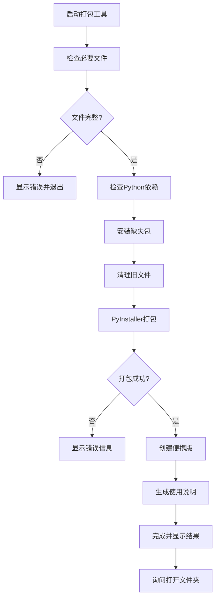

# CLAUDE.md - 打包工具 模块

**[根目录](../../CLAUDE.md) > [打包工具](../) > **打包工具**

## 变更记录 (Changelog)

- **2025-10-16 09:10:18** - 创建模块文档，详细分析打包工具架构和部署流程

## 模块职责

打包工具.py 是Temu PDF重命名工具的**部署和分发模块**，负责：

- **依赖检查**: 自动检测并安装缺失的Python包
- **环境准备**: 清理旧的打包文件和缓存
- **应用打包**: 使用PyInstaller生成可执行文件
- **便携版创建**: 生成包含说明文档的完整分发包
- **用户友好**: 提供清晰的进度提示和错误处理

## 入口与启动

### 启动方式
```bash
# 方式1: 直接运行打包脚本
python 打包工具.py

# 方式2: 双击运行(Windows环境)
打包工具.py
```

### 主函数
```python
def main():
    """主函数 - 执行完整的打包流程"""
    print("=" * 50)
    print("PDF重命名工具打包程序")
    print("=" * 50)

    # 1. 检查必要文件
    # 2. 安装缺失的依赖
    # 3. 清理旧文件
    # 4. 执行打包
    # 5. 创建便携版
    # 6. 提供用户反馈
```

## 对外接口

### 主要函数接口

| 函数名 | 参数 | 返回值 | 功能描述 |
|--------|------|--------|----------|
| `install_missing_packages()` | 无 | `bool` | 检查并安装缺失的Python包 |
| `check_files()` | 无 | `bool` | 检查打包所需的必要文件 |
| `clean_old_files()` | 无 | `None` | 清理旧的打包文件和目录 |
| `build_exe()` | 无 | `bool` | 使用PyInstaller打包可执行文件 |
| `create_portable_package()` | 无 | `bool` | 创建便携式分发包 |

### 核心配置
```python
# PyInstaller打包参数
build_cmd = [
    sys.executable, "-m", "PyInstaller",
    "--name=PDF_Rename_Operation",
    "--onefile",                    # 单文件模式
    "--windowed",                   # 无控制台窗口
    "--icon=PDF_Rename_Operation_Logo.ico",  # 应用图标
    "--clean",                      # 清理临时文件
    "--noconfirm",                  # 不询问确认
    "PDF_Rename_Operation.py"       # 入口文件
]
```

## 关键依赖与配置

### 必需依赖检查
```python
required_packages = {
    "PyQt5": "GUI框架",
    "PyPDF2": "PDF处理",
    "pandas": "Excel报告",
    "PIL": "图像处理"  # Pillow库
}

# 检查逻辑
try:
    subprocess.run([sys.executable, "-c", f"import {package}"],
                  check=True, capture_output=True)
except subprocess.CalledProcessError:
    missing_packages.append(package)
```

### 文件依赖清单
```python
required_files = [
    "PDF_Rename_Operation.py",           # 主程序文件
    "PDF_Rename_Operation_Logo.ico"      # 应用程序图标
]

# 清理目标
cleanup_targets = [
    'build',                            # PyInstaller构建目录
    'dist',                             # PyInstaller输出目录
    'PDF重命名工具_便携版',              # 便携版目录
    '*.spec'                           # PyInstaller配置文件
]
```

### 输出配置
```python
# 生成的文件结构
portable_structure = {
    "PDF重命名工具_便携版/": {
        "PDF_Rename_Operation.exe": "主程序",
        "使用说明.txt": "用户指南"
    }
}

# 默认输出位置
dist_dir = "dist/"
portable_dir = "PDF重命名工具_便携版/"
```

## 数据模型

### 打包流程


### 便携包结构
```
PDF重命名工具_便携版/
├── PDF_Rename_Operation.exe    # 主程序(~30-50MB)
└── 使用说明.txt               # 用户使用指南
```

## 测试与质量

### 打包测试要点

#### 1. 依赖检查测试
- [ ] 正确检测已安装的包
- [ ] 自动安装缺失的包
- [ ] 处理安装失败的情况
- [ ] 支持不同Python版本

#### 2. 文件检查测试
- [ ] 检测主程序文件存在
- [ ] 检测图标文件存在
- [ ] 验证文件路径正确性

#### 3. 打包过程测试
- [ ] PyInstaller命令执行正确
- [ ] 生成的exe文件可运行
- [ ] 图标正确嵌入
- [ ] 无控制台窗口显示

#### 4. 便携版测试
- [ ] 目录结构创建正确
- [ ] 文件复制成功
- [ ] 使用说明生成完整
- [ ] 最终包可独立运行

### 错误处理机制
```python
# 依赖安装错误处理
try:
    subprocess.run([sys.executable, "-m", "pip", "install"] + missing_packages,
                  check=True)
    print("包安装成功")
    return True
except subprocess.CalledProcessError:
    print("包安装失败")
    return False

# 打包过程错误处理
if result.returncode == 0:
    print(f"打包成功! 文件大小: {size_mb:.1f}MB")
    return True
else:
    print("打包失败!")
    if result.stderr:
        print("错误信息:", result.stderr)
    return False
```

### 用户反馈机制
```python
# 进度提示
print("正在检查必要文件...")
print("正在安装缺少的包...")
print("开始打包...")
print("创建便携包...")

# 结果反馈
print(f"\n打包完成!")
print("生成的文件:")
print("1. dist/PDF_Rename_Operation.exe - 单文件可执行程序")
print("2. PDF重命名工具_便携版/ - 包含说明的完整包")
```

## 常见问题 (FAQ)

### Q1: 提示"找不到文件"错误
**A**: 确保`PDF_Rename_Operation.py`和`PDF_Rename_Operation_Logo.ico`在同一目录下。

### Q2: pip安装包失败
**A**: 可能需要管理员权限，或使用国内镜像源：
```bash
pip install -i https://pypi.tuna.tsinghua.edu.cn/simple/ 包名
```

### Q3: PyInstaller打包失败
**A**: 检查PyInstaller版本，或先清理缓存：
```bash
pip install --upgrade PyInstaller
```

### Q4: 生成的exe文件过大
**A**: 这是正常现象，PyInstaller会将所有依赖打包，通常30-50MB。

### Q5: exe文件运行时被杀毒软件拦截
**A**: 添加到杀毒软件白名单，这是PyInstaller打包程序的常见现象。

### Q6: 生成的exe无法运行
**A**: 检查目标机器是否缺少必要的系统库，如Visual C++ Redistributable。

## 相关文件清单

### 主要文件
- `打包工具.py` (225行) - 打包脚本主程序

### 输入文件
- `PDF_Rename_Operation.py` - 待打包的主程序
- `PDF_Rename_Operation_Logo.ico` - 应用程序图标

### 配置文件
- `PDF重命名工具.spec` - PyInstaller配置文件
- `PDF_Rename_Operation.spec` - 备用配置文件

### 输出文件
- `dist/PDF_Rename_Operation.exe` - 单文件可执行程序
- `PDF重命名工具_便携版/` - 完整分发包目录

## 高级配置

### PyInstaller配置优化
```python
# 可添加的高级参数
advanced_options = [
    "--add-data=资源文件路径;目标路径",    # 添加额外数据文件
    "--hidden-import=模块名",             # 添加隐藏导入
    "--exclude-module=不需要的模块",       # 排除模块以减小体积
    "--upx-dir=UPX路径",                 # 指定UPX压缩工具
    "--runtime-hook=钩子文件.py"         # 运行时钩子
]
```

### 自定义使用说明模板
```python
readme_template = """
PDF重命名工具使用说明
==================

版本: {version}
构建时间: {build_time}
文件大小: {size:.1f}MB

使用方法:
1. 双击运行"PDF_Rename_Operation.exe"
2. 输入测试方法，用分号分隔
3. 选择PDF文件
4. 点击重命名开始处理

技术支持:
- 如遇问题请联系技术支持
- 建议在Windows 10/11环境下使用
"""
```

### 批量脚本扩展
```python
# 可以添加的额外功能
def create_installer():
    """创建安装程序"""
    # 使用NSIS或其他工具创建安装包
    pass

def sign_executable():
    """对可执行文件进行数字签名"""
    # 使用代码签名证书
    pass

def upload_to_release():
    """上传到发布平台"""
    # 自动化发布流程
    pass
```

## 性能与优化

### 打包性能
- **依赖检查**: 快速扫描，通常几秒钟
- **包安装**: 取决于网络速度和包大小
- **PyInstaller打包**: 通常1-5分钟
- **文件复制**: 几秒钟

### 优化建议
1. **使用缓存**: PyInstaller会缓存一些文件，二次打包更快
2. **并行处理**: 可以考虑并行化某些步骤
3. **增量更新**: 只在源文件变化时重新打包
4. **压缩优化**: 使用UPX进一步减小exe体积

### 故障排除
```python
# 常见问题诊断
def diagnose_environment():
    """诊断打包环境"""
    print("=== 环境诊断 ===")
    print(f"Python版本: {sys.version}")
    print(f"PyInstaller版本: {get_pyinstaller_version()}")
    print(f"当前目录: {os.getcwd()}")
    print(f"必要文件: {check_required_files()}")
    print(f"网络连接: {check_network()}")
```

## 部署最佳实践

### 发布前检查清单
- [ ] 主程序功能测试通过
- [ ] 打包脚本运行正常
- [ ] 生成的exe在纯净环境测试
- [ ] 杀毒软件兼容性测试
- [ ] 使用说明文档完整
- [ ] 版本号和更新日志准备

### 版本管理
```python
# 建议的版本控制策略
version_info = {
    "major": 1,
    "minor": 0,
    "patch": 0,
    "build": datetime.now().strftime("%Y%m%d")
}

# 生成版本文件名
exe_name = f"PDF重命名工具_v{major}.{minor}.{patch}_build{build}.exe"
```

### 分发策略
1. **便携版**: 适合临时使用和测试
2. **安装包**: 适合正式部署
3. **自动更新**: 可考虑集成更新检查机制
4. **多平台**: 如需要可考虑支持macOS/Linux